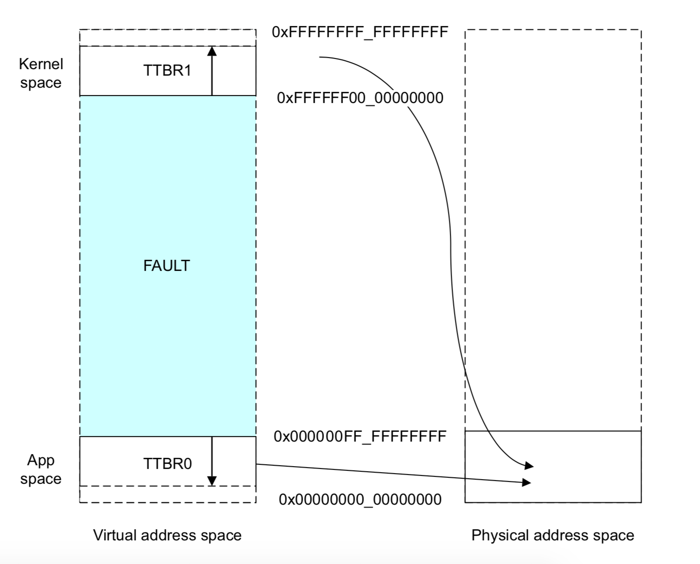

# Rustable 

*Rust 实现的 Raspberry Pi 3（AArch64）平台 OS*

计55 乔逸凡 2015013188

计55 谭咏霖 2015011491


[TOC]


本实验基于 Stanford CS140e 课程实验框架，复现了课程作业内容，并在此基础上参考 µcore 为其添加了物理内存按页分配、虚拟内存、用户进程管理、进程调度等功能，并完成了在 Raspberry Pi 3 上的真机测试。


# 实验复现部分


## 环境配置

由于开发环境为 Rust，首先需要安装 Rust：

```shell
curl https://sh.rustup.rs -sSf | sh
```

Rust 版本迭代快，因此较新的版本可能会使得本实验无法通过编译。需要将版本控制在 `nightly-2018-01-09`：

```shell
rustup default nightly-2018-01-09
rustup component add rust-src
```

接着，本实验使用 xargo 包管理器，因此需要安装 xargo：

```shell
cargo install xargo
```

实验包含汇编代码，因此需要 gcc 交叉编译环境（aarch64-none-elf)。

macOS 下可使用如下指令安装：

```shell
brew tap SergioBenitez/osxct
brew install aarch64-none-elf
```

Linux 下可使用如下指令安装：

```shell
wget https://web.stanford.edu/class/cs140e/files/aarch64-none-elf-linux-x64.tar.gz
tar -xzvf aarch64-none-elf-linux-x64.tar.gz
sudo mv aarch64-none-elf /usr/local/bin
```

并设置环境变量：

```shell
PATH="/usr/local/bin/aarch64-none-elf/bin:$PATH"
```

注：kernel 的 `ext/init.S` 在 Linux 的 aarch64-none-elf-gcc 下会报编译错误，因此 kernel 部分可能无法编译。

如此就完成了实验所需的环境配置。

### 编译 & 运行

 `/Rustable/os/bootloader` （“伪”bootloader）、`/Rustable/os/kernel`（os kernel）、 `/Rustable/user/user` （用户程序）下均可分别编译。以`/Rustable/os/bootloader` 为例：

```shell
cd Rustable/os/bootloader
make
```

执行上述指令便可完成编译。

将上述过程生成的文件 `/Rustable/os/bootloader/build/bootloader.bin` 改名为 `kernel8.img` 并拷入插在 Raspberry Pi 3 上的 sd 卡根目录下，便可完成 bootloader 设置。（需有 CS140e 提供的 `config.txt` 和 `bootcode.bin`）

接着，将 Raspberry Pi 3 插入电脑，在 `/Rustable/os/kernel` 文件夹下便可通过如下命令编译 kernel，并将 kernel 传入 Raspberry Pi 3：

```shell
cd ../kernel
make screen
```


## bootloader 与 启动

真正的 bootloader（把 os 从代码中加载进来并执行）在实验框架中已通过文件 `bootcode.bin` 和 `config.txt` 实现：其可指定 kernel 放入的地址，并将 kernel8.img 从硬盘中读入并写入内存，最后跳到起始地址执行。

我们实现的（伪）bootloader 是为了调试方便，而实现的一个从 bootloader 层面看与 os 等价的工具（即真正的 bootloader 实际 load 的代码）：其作用是从串口接受电脑传来的 kernel 镜像，写入内存并执行。

以下为不加入（伪）bootloader 的内存布局：

```
------------------- 0x400000
       kernel
------------------- 0x80000

------------------- 0x0
```

为了使我们的（伪）bootloader 不对 kernel 的地址造成影响，我们将（伪）bootloader 放到了地址 `0x400000` 上，并修改上文 `config.txt` 使硬件从该地址执行，然后将 kernel 传到 `0x80000` 处，并跳去开始执行。以下为实际的内存布局：

```
  (fake)bootloader
-------------------- 0x400000
        kernel
-------------------- 0x80000

-------------------- 0x0
```

考虑到后续工作需将 MMU 开启实现虚实地址转化，而 kernel 地址应通过高地址访问（physical addr + `0xffffff0000000000`），因此在现有框架下我们考虑在（伪）bootloader 中直接设置好页表并打开 MMU，如此待 os 进入 kernel 时，其已经可以通过高地址访问 kernel 了。

详细过程见「虚拟内存管理」部分。


## 同步互斥

管程由于实现复杂、消耗资源多、效率低等特点基本已被现代 OS 抛弃，因此我们未对此进行实现。而同步互斥本身在 Rust 语言中有较方便实现。因此此部分介绍 Rust 的语法支持以及在本实验中的用途。

Rust 认为全局可变对象（mut static）是 unsafe 的，因为其线程不安全。其正确做法如下（以全局 ALLOCATOR 为例）：

```rust
/// 结构体声明
pub struct Allocator(Mutex<Option<imp::Allocator>>);

/// 函数实现
impl Allocator {
    pub const fn uninitialized() -> Self {
        Allocator(Mutex::new(None))
    }
    pub fn initialize(&self) {
        *self.0.lock() = Some(imp::Allocator::new());
    }
   	/// 调用内部 Allocator 的 mut 函数
    pub fn init_memmap(&self, base: usize, npage: usize, begin: usize) {
        self.0.lock().as_mut().expect("").init_memmap(base, npage, begin);
    }
}

/// 全局静态变量声明（此处是 immutable）
pub static ALLOCATOR: Allocator = Allocator::uninitialized();

/// 初始化
ALLOCATOR.initialize();

/// 使用内部 Allocator 的 mut 引用
ALLOCATOR.init_memmap(base, npage, begin);
```

可见，如果直接声明一个 `imp::Allocator` 的 mut static 对象，则其在访问时是 unsafe 的。而如果使用 `Mutex` 包裹，则可在包裹的外层 `Allocator` 中使用 `self.0.lock()` 互斥拿到该对象，并使用 `as_mut()` 函数获取 mut 引用，从而调用 mut 函数。

在我们的 Rustable 中，类似的全局变量及作用如下：

- `ALLOCATOR`：提供基于页的物理内存管理，以及系统可用的 `alloc()`、`dealloc()` 函数（这在 Rust 中称为一个 trait：`Alloc` trait；
- `SCHEDULER`：提供进程调度管理，如：
  - `add(proc: Process)`：将某一个进程加入管理队列；
  - `switch(&self, new_state: State, tf: &mut TrapFrame)`：将当前进程状态设为 `new_state` 并通过修改 `*tf` 完成进程调度。
- `FILE_SYSTEM`：提供对硬盘的读操作

可见，上述操作的确是需要全局访问，且要求线程安全的。


## 文件系统

实现了一个只读的 FAT32 文件系统。

### Layout


如上图，为 FAT32 文件系统的格式。

#### MBR

位于硬盘第一个扇区（sector 0）。包含四个分区信息，每个分区信息包含：

- 文件系统类型；
- 起始扇区；（指向 EBPB）
- boot indicator；
- CHS

#### EBPB

包括 BPB（Bios parameter block）和 FAT 的 Layout，如 FAT 开始的 offset，每个 FAT 所占扇区数，每个扇区的字符数，FAT 的数量等。

#### FAT

FAT 重点描述了每个 cluster 在链表中的下一个 cluster 编号。其规定如下：

- `0x?0000000`: A free, unused cluster.
- `0x?0000001`: Reserved.
- `0x?0000002`-`0x?FFFFFEF`: A data cluster; value points to next cluster in chain.
- `0x?FFFFFF0`-`0x?FFFFFF6`: Reserved.
- `0x?FFFFFF7`: Bad sector in cluster or reserved cluster.
- `0x?FFFFFF8`-`0x?FFFFFFF`: Last cluster in chain. Should be, but may not be, the EOC marker.

如图，图片下边的序号是 FAT（以及对应 Cluster）的序号，图片中的内容是 FAT 所存储的数值：


#### Cluster

具体存储数据。


### 具体实现

#### BlockDevice trait

为了文件系统可以通用使用于任何物理、虚拟内存设备于是有了 BlockDevice trait。

`2-fs/fat32/src/trait/block_device.rs`

只要设备实现了 BlockDevice trait，文件系统就可以使用统一的 `read_sector()`、`write_sector()` 等接口来进行对设备的读写操作。

```rust
pub trait BlockDevice: Send {
    fn sector_size(&self) -> u64
    fn read_sector(&mut self, n: u64, buf: &mut [u8]) -> io::Result<usize>;
    fn read_all_sector(&mut self, n: u64, vec: &mut Vec<u8>) -> io::Result<usize>
    fn write_sector(&mut self, n: u64, buf: &[u8]) -> io::Result<usize>;
}
```

#### CachedDevice

`2-fs/fat32/src/vfat/cache.rs`

因为直接读取硬盘的开销很大，所以实现了 CachedDevice 来封装 BlockDevice，把扇区缓存在 HashMap 中。并实现了 `get()` 和 `get_mut()` 接口来获得缓存中的扇区，如果缓存中没有，再从硬盘中读取。

其中 Partition 是一个分区，使用逻辑扇区，其大小是硬盘中物理扇区的大小的倍数。

```rust
pub struct CachedDevice {
    device: Box<BlockDevice>,
    cache: HashMap<u64, CacheEntry>,
    partition: Partition
}
```

#### 读取 MBR

`2-fs/fat32/src/mbr.rs`

- 使用 BlockDevice 的 `read_all_sector()` 接口来读取第 0 个扇区
- 检查是否以 `0x55AA` 结尾
- 检查分区表 (Partition Table) 每个表项的 Boot Indicator
  - `0x0`：表示没有；
  - `0x80`：表示分区是 bootable (or active) 的；
  - 其他：报错

#### 读取 EBPB

`2-fs/fat32/src/vfat/ebpb.rs`

- MBR 中的分区表表项中的 Relative Sector 位指明了该分区的起始扇区，而 EBPB 就是在分区的起始扇区中，所以同样可以使用 `read_all_sector()` 接口来读取此扇区
- 检查是否以 `0x55AA` 结尾

#### 实现文件系统

`2-fs/fat32/src/vfat/vfat.rs`

##### 初始化

- 读取 MBR
- 对于 MBR 分区表的每个表项，检查 Partition Type 位，如果是 `0x0B` 或 `0x0C` 则表示此分区为 FAT32 文件系统的分区
- 然后读取 EBPB
- 根据 EBPB 设置分区结构体的起始大小和扇区大小（逻辑扇区）
- 然后初始化文件系统的 CachedDevice、扇区大小、每簇扇区数、FAT 扇区数、FAT 起始扇区、数据起始扇区、根目录所在的簇。

##### 結構

```rust
pub struct VFat {
    device: CachedDevice,
    bytes_per_sector: u16,
    sectors_per_cluster: u8,
    sectors_per_fat: u32,
    fat_start_sector: u64,
    data_start_sector: u64,
    root_dir_cluster: Cluster,
}
```

##### 接口

```rust
fn open<P: AsRef<Path>>(self, path: P) -> io::Result<Self::Entry>
fn create_file<P: AsRef<Path>>(self, _path: P) -> io::Result<Self::File>
fn create_dir<P>(self, _path: P, _parents: bool) -> io::Result<Self::Dir>
fn rename<P, Q>(self, _from: P, _to: Q) -> io::Result<()>
fn remove<P: AsRef<Path>>(self, _path: P, _children: bool) -> io::Result<()> {
```


#### 實現文件的 Metadata

`2-fs/fat32/src/vfat/metadata.rs`

Cluster 中每個目錄項保存了文件/目錄的元數據（Metadata）結構體：

```rust
pub struct Metadata {
    attributes: Attributes,
    created: Timestamp,
    accessed: Timestamp,
    modified: Timestamp,
}
```

根據不同的 offset 從硬盤中目錄項中提取出各項訊息，填入文件的 Metadata 的結構體中，其中使用了屬性、時間戳的結構體：

1. **屬性 Attributes**：該結構體用來保存目錄項中的屬性字節，目錄項中的屬性是 8 bit 所以結構體也只有一個 u8 類型的成員，其中該成員為以下不同值會表示目錄項有不同的屬性。

- READ_ONLY: `0x01`


- HIDDEN: `0x02`
- SYSTEM: `0x04`
- VOLUME_ID: `0x08`
- DIRECTORY: `0x10`
- ARCHIVE: `0x20`

2. **時間戳 Timestamp**：用以保存創建時間、創建日期、上次修改時間、上次修改日期、上次訪問日期。

```rust
pub struct Timestamp {
    pub time: Time,
    pub date: Date
}
```

使用了結構體 `Time` 和 `Date` 負責按指定數據位抽取信息：

```
15........11 10..........5 4..........0
|   hours   |   minutes   | seconds/2 |

15.........9 8...........5 4..........0
|    Year   |    Month    |    Day    |
```


#### 實現 Directory

Dir 結構體是抽象保存目錄的數據結構，提供接口來對目錄進行查找。

```rust
pub struct Dir {
    start_cluster: Cluster,		// 目錄對應的起始 cluster
    vfat: Shared<VFat> 			// 目錄所在的文件系統
}
```

實現了 `entries` 函數，讀取目錄對應的 cluster 鏈的數據，並返回遍歷目錄里的目錄項的 DirIterator（後面有說明）

實現了 `find` 函數，根據給定名字，使用 `entries` 函數來遍歷目錄里的目錄項找出名字相同的 Entry（後面有說明）。其中查找是大小寫不敏感的。

##### 目錄項

和結構體 Dir 不同，目錄項是根據硬盤上實際保存的數據位分布來保存信息的數據結構。

因為 Dir 不同類型，分別是：

- Unknown Directory Entry：未知目錄項，用於判斷目錄是否有效目錄
- Regular Directory Entry：正常目錄項
- Long File Name (LFN) Entry：長文件名目錄項

使用 `union` 來保存目錄項，因為可以通過 unsafe 來以不同的結構來解析內容。

```rust
pub union VFatDirEntry {
    unknown: VFatUnknownDirEntry,
    regular: VFatRegularDirEntry,
    long_filename: VFatLfnDirEntry,
}
```

**正常目錄項**

VFatRegularDirEntry：正常目錄項的數據位分布如下

| Offset (bytes) | Length (bytes) | Meaning                                    |
| -------------- | -------------- | ------------------------------------------ |
| 0              | 8              | 文件名（可以以 `0x00` 或 `0x20` 提早結束） |
| 8              | 3              | 文件擴展名                                 |
| 11             | 1              | 文件屬性（使用結構體 Attributes）          |
| 12             | 2              | 沒有使用                                   |
| 14             | 2              | 創建時間（使用結構體 Timestamp）           |
| 16             | 2              | 創建日期（使用結構體 Timestamp）           |
| 18             | 2              | 上次訪問日期（使用結構體 Timestamp）       |
| 20             | 2              | 數據所在的起始 Cluster 編號的高 16 位      |
| 22             | 2              | 上次修改時間（使用結構體 Timestamp）       |
| 24             | 2              | 上次修改日期（使用結構體 Timestamp）       |
| 26             | 2              | 數據所在的起始 Cluster 編號的高 16 位      |
| 28             | 4              | 文件大小（bytes）                          |

因此我們根據以上表格來構造結構體：

```rust
pub struct VFatRegularDirEntry {
    filename: [u8; 8],
    extension: [u8; 3],
    attributes: Attributes,
    reserved: Unused<u8>,
    creation_time_subsecond: Unused<u8>,
    created: Timestamp,
    accessed: Date,
    cluster_high: u16,
    modified: Timestamp,
    cluster_low: u16,
    file_size: u32
}
```

**長文件名目錄項**

VFatLfnDirEntry：長文件名目錄項的數據位分布如下

| Offset (bytes) | Length (bytes) | Meaning                                     |
| -------------- | -------------- | ------------------------------------------- |
| 0              | 1              | 序號                                        |
| 1              | 10             | 文件名1（可以以 `0x00` 或 `0xFF` 提早結束） |
| 11             | 1              | 文件屬性（使用結構體 Attributes）           |
| 12             | 1              | 沒有使用                                    |
| 13             |                | 校驗和                                      |
| 14             | 12             | 文件名2（可以以 `0x00` 或 `0xFF` 提早結束） |
| 26             | 2              | 沒有使用                                    |
| 28             | 4              | 文件名3（可以以 `0x00` 或 `0xFF` 提早結束） |

長文件名目錄項中的文件名以 Unicode 表示，文件名可以通過把每個長文件名目錄項的三個文件名都連接起來獲得。一串长文件名目录项后面还会跟一个短文件名目录项，这个目录项记录了除文件名以外的这个文件的信息。

根據以上表格來構造結構體：

```rust
pub struct VFatLfnDirEntry {
    sequence_number: u8,
    name_1: [u16; 5],
    attributes: u8,
    unused_1: Unused<u8>,
    checksum: u8,
    name_2: [u16; 6],
    unused_2: Unused<u16>,
    name_3: [u16; 2],
}
```

**未知目錄項**

VFatUnknownDirEntry

未知目錄項只明確保存了目錄項的第一個字節和保存其屬性的字節，如以判斷此目錄性的類型。

目錄項的第一個字節：

- `0x00`：表示目錄的結束
- `0xE5`：表示沒有使用/已刪除的目錄項
- 其他情況表示正常目錄項或長文件名目錄項的序號

屬性字節：

- 如果是 `0x0F` 則表示是長文件名目錄項，其他情況表示是正常目錄項。

```rust
pub struct VFatUnknownDirEntry {
    entry_info: u8,
    unknown: Unused<[u8; 10]>,
    attributes: u8,
    unknown_2: Unused<[u8; 20]>,
}
```

##### 迭代器 DirIterator

為 Dir 實現了一個 Iterator，用來遍歷目錄里的各個項。

```rust
pub struct DirIterator {
    data: Vec<VFatDirEntry>,	// 
    offset: usize,				// 當前遍歷到的位置
    vfat: Shared<VFat>,
}
```

`data` 是保存該當前目錄的 cluster 鏈所讀出來的數據。

實現了 Iterator trait 的 `next` 函數：遍歷時，想要取得當前目錄里的下一個目錄項時，只需要從 `data` 的 `offset` 處開始找，以未知目錄項來解析數據：

- 如果表示目錄結束，則停止；
- 如果表示沒有使用或已刪除的目錄項，則不做任何處理；
- 如果是正常目錄項，則返回目錄項，更新 `offset`；
- 如果是長文件名目錄項，則壓入數組，繼續查看下一個目錄項，並更新 `offset`。直到遇到正常目錄項，就可以把這個數組返回；

同時也實現了 `create_entry` 函數，用於在遍歷時把獲得的正常目錄項或長文件名目錄項數組初始化為一個目錄或文件的Entry（Entry 將會在之後展開說明）。


#### 實現 File

File 結構體是抽象保存文件的數據結構，提供接口來讀取文件。

```rust
pub struct File {
    start_cluster: Cluster,			// 文件數據起始 Cluster
    vfat: Shared<VFat>,				// 文件所在的文件系統
    size: u32,						// 文件大小
    pointer: u64,					// 讀取指針（當前位置）
    cluster_current: Cluster,		// 當前讀取的 Cluster
    cluster_current_start: usize,	// 當前讀取的 Cluster 的起始地址   
}
```

為 File 實現 `io::Read`、`io::Write` 和  `io::Seek` 使 File 有讀、寫和在把指針設在指定位置的功能。


#### 實現 Entry 

Entry 是一個表示文件或目錄的結構體，是文件系統操作所使用的數據結構，其定義如下：

```rust
pub struct Entry {
    item: EntryData,
    name: String,
    metadata: Metadata,
}
```

其中 EntryData 是一個 enum 類型，表示該 Entry 是文件還是目錄，同時儲存了數據。

Entry 實現了如下的函數：

- `new_file`：給定文件名、Metadata 和 File 結構體，創建文件的 Entry
- `new_dir`：給定目錄名、Metadata 和 Dir 結構體，創建目錄的 Entry
- `name`：返回文件名或目錄名
- `metadata`：返回 Metadata 的引用
- `as_file` ：如果是一個文件的 Entry 則返回其 File 結構體的引用，否則返回 None
- `as_dir` ：如果是一個目錄的 Entry 則返回其 Dir 結構體的引用，否則返回 None
- `into_file` ：如果是一個文件的 Entry 則返回其 File 結構體，否則返回 None
- `into_dir` ：如果是一個目錄的 Entry 則返回其 Dir 結構體，否則返回 None


#### 文件系統的功能

因為目前只是一個 Read-only 的文件系統，所以只實現了 `open` 函數，用於打開指定路徑。該函數使用了標準庫里的 Path 結構，它提供了 `component` 函數可以返回一個路徑拆分成目錄或文件的名字的數組。先初始化根目錄的 Entry ，遍歷這個數據，使用 Dir 的 `find` 函數來在當前目錄里根據名字來獲取相應的 Entry，並更新當前目錄，一層一層地進入目錄，直到數組結束，即可得到給定的目錄或文件的 Entry 並返回。


# 移植 µcore 部分


## 物理内存管理

物理內存包含两個部分，首先是探測系統中的物理內存大小和布局，然後建立對物理內存的頁管理。

實現物理內存管理結構體 `Pmm`，其初始化函數實現如下：

```rust
impl Pmm {
    pub fn init(&self) {
        ALLOCATOR.initialize();        
        page_init();
    }
}
```

此函數分別實現了對物理內存的頁管理的初始化和探測物理內存。下面會詳細說明物理內存各部分的原理和實現。

### 探測物理內存

當 Rustable 被啟動之後，我們需要知道實際有多少內存可以用。所以對於操作系統的物理內存管理，第一步就是要探測物理內存的大小和布局。獲取內存大小的方法是使用 ATAG。

#### ATAG 

ATAG（ARM tags）是 ARM bootloader 用來傳送系統信息給 kernel 的 一種機制。樹莓派上電後，會把 ATAG 結構體數組放到 `0x100` 上。每個 ATAG 結構體會有一個  8 byte 的 header，其定義如下：

```rust
struct AtagHeader {
    dwords: u32,
    tag: u32,
}
```

- `dwords` ：表示整個 ATAG 的長度（單位是 32-bit words），包括 header。
- `tag`：表示 ATAG 的類型。

##### ATAG 類型

ATAG 有 10 總類型，而樹莓派只使用以下四種：

| Name    | tag           | Size            | Description              |
| ------- | ------------- | --------------- | ------------------------ |
| CORE    | `0x54410001`  | 5 or 2 if empty | 數組中的首個 ATAG        |
| NONE    | ` 0x00000000` | 2               | 空的 ATAG，表示數組結束  |
| MEM     | `0x54410002`  | 4               | 表示一塊連續的物理內存塊 |
| CMDLINE | `0x54410009`  | 可變            | 命令行                   |

在 Rustable 中，我們使用了前三種類型的 ATAG，根據它們的結構，分別為他們實現了對應的結構體。

```rust
pub struct Core {
    pub flags: u32,
    pub page_size: u32,
    pub root_dev: u32
}

pub struct Mem {
    pub size: u32,
    pub start: u32
}

pub struct Cmd {
    pub cmd: u8
}
```

ATAG 的類型決定了 header 後的數據該被如何解釋。所以在實現中，我們的 `Atag` 結構體，使用 union 來表示 header 後的數據，以方便我們使用不同的三種結構體來解釋。

```rust
pub struct Atag {
    dwords: u32,
    tag: u32,
    kind: Kind
}

pub union Kind {
    core: Core,
    mem: Mem,
    cmd: Cmd
}
```

##### 遍歷 ATAG 數組

根據 Atag Header 中 `dwords` 的大小，實現 `next()` 函數計算出下一塊 ATAG：

```rust
pub fn next(&self) -> Option<&Atag> {
    let curr_addr = (self as *const Atag as *const u32);
    let next_addr = unsafe{ &*(curr_addr.add(self.dwords as usize) as *const Atag) };
    if next_addr.tag == Atag::NONE {
    	return None;
    }
    Some(next_addr)
}
```

##### 封裝 Atag

由於在 Rust 中使用 union 是 unsafe 的，所以需要把上述的 `Atag` 結構體用 enum 封裝一層：

```rust
pub enum Atag {
    Core(raw::Core),
    Mem(raw::Mem),
    Cmd(&'static str),
    Unknown(u32),
    None
}
```

實現一個 `from` 函數把 `struct Atag` 轉換為 `enum Atag`，該函數會根據 `struct Atag` 的類型，從 union 中以對應的結構體（ `Core`、`Mem`、`Cmd` ）讀取 ATAG 的內容，把相應的結構體封裝成 `enum Atag` 並返回。


### 物理內存的頁管理

#### Page 結構體

在獲得可用物理內存範圍之後，系統需要建立相應的數據結構來管理物理頁，在 Arm 的系統結構中，頁的大小可以有 4KB、16KB 不等。而我們參考 ucore 使用以 4KB 為物理頁的大小。每個物理頁可以用一個 `Page` 結構體來表示。

```rust
pub struct Page {
    pub list_entry: LinkedList,
    pub reference: i32,
    pub flags: u32,
    pub property: u32,
}
```

- `list_entry`：保存连续内存空闲頁的侵入式鏈表。
- `reference`：頁被頁表引用的記數。如果这个页被页表引用了，即在某页表中有一个页表项设置了一个虚拟页到这个 Page 管理的物理页的映射关系，就会把 Page 的 `reference` 加一；反之，若页表项取消，即映射关系解除，就会把 Page 的 `reference` 减一。
- `flags`：表示此物理页的状态标记：
  - bit 0: 表示 Reserved，如果是被保留的页，则 bit 0 会设置為 1
  - bit 1: 位表示 Property，沒有使用
  - bit 2: 位表示 Used， 如果這個頁被分配了，則 bit 2 會設置為 1
- `property`：用来记录某连续内存空闲块的大小（即地址连续的空闲页的个数）。

#### 對齊

要實現以頁為單位來管理系統中的物理內存，我們還需要實現對於地址的頁對齊。這里定義 `PGISZE` 為一個頁的大小，即 4KB = 4096 byte。分別實現了向上對齊 `align_up()` 和向下對齊 `align_down()` 函數：

```rust
pub fn align_down(addr: usize, align: usize) -> usize {
    if align == 0 || align & (align - 1) > 0 { panic!("ERROR: Align is not power of 2"); }
    addr / align * align
}

pub fn align_up(addr: usize, align: usize) -> usize {
    if align == 0 || align & (align - 1) > 0 { panic!("ERROR: Align is not power of 2"); }
    (addr + align - 1) / align * align
}
```

#### 初始化頁管理

`Pmm` 的初始化中，調用了 `page_init` 這個函數來初始化系統中的頁。

首先，該函數主要通過遍歷 `Atag` 數組獲取連續的物理內存塊，計算出最大可用內存地址 `maxpa`。這里定義了 Rustable 所用的物理內存大小 `PMEMSIZE` 為 `512 * 1024 * 1024 `byte，即 512M。所以 `maxpa` 需要限制在 `PMEMSIZE` 之內。

```rust
for atag in Atags::get() {
    match atag.mem() {
        Some(mem) => {
            let begin = mem.start as usize;
            let end = mem.size as usize;
            kprintln!("mem: {:x} {:x}", begin, end);
            if maxpa < end && begin < PMEMSIZE {
                maxpa = end;
            }
        },
        None => {}
    }
}
if maxpa > PMEMSIZE {
    maxpa = PMEMSIZE;
}
```

需要管理的物理页个数。然後在 KERNEL_PAGES 的地址上分配 `npage` 個 `Page` 結構體的空間來保存這些結構體，用以保存所對應的頁的信息。現在，我們就可以把這些頁設為 Reserved，即不能被加到空閒塊鏈表中的。

```rust
let npage = maxpa / PGSIZE;

let pages = align_up(KERNEL_PAGES, PGSIZE) as *mut Page;
let page = unsafe { std::slice::from_raw_parts_mut(pages, npage) };

for i in 0..npage {
    page[i].SetPageReserved();
}
```

我們就可以预估出管理页级物理内存空间所需的 `Page` 结构的内存空间所需的内存大小。換言之，真正能使用的可用地址 FREEMEM 為這個 Page 結構體數組的結束地址。

```rust
let FREEMEM = (pages as usize) + mem::size_of::<Page>() * npage;
```

計算好地址的可用範圍在 `FREEMEM` 以上之後，重新遍歷 `Atag` 數組，把連續物理內存塊嚴格限制於 `FREEMEM` 之上，並把開始地址與結束地址以頁對齊。根據探測到的空閒物理空間，調用 `ALLOCATOR` 的 `init_memmap` 函數來創建保存連續空閒內存頁的鏈表。此函數將在後面詳細說明。

```rust
for atag in Atags::get() {
    match atag.mem() {
        Some(mem) => {
            let mut begin = mem.start as usize;
            let mut end = mem.size as usize;
            if begin < PADDR(FREEMEM) {
                begin = PADDR(FREEMEM);
            }
            if begin < end {
                begin = align_up(begin, PGSIZE);
                end = align_down(end, PGSIZE);
                let page_addr = pa2page(begin) as *mut usize as usize;
                if begin < end {
                    ALLOCATOR.init_memmap(page_addr, (end - begin) / PGSIZE, begin);
                }
            }
        }

        None => {}
    }
}
```


#### Allocator

Allocator 是一個頁物理內存管理的結構體，其功能有管理空閒頁（ `init_memmap` )、管理用戶頁（ `init_user` ）、分配頁（ `alloc` ）、釋放頁（ `dealloc` ）、清理頁 （ `clear_page` ）、拷貝頁（ `copy_page` ）和分配指定虛疑地址的虛擬頁（ `alloc_at` ）。這里部分函數會在稍後的虛理內存管理和用戶進程管理中詳細說明。

```rust
pub struct Allocator {
    free_list: LinkedList,
    n_free: u32,
    base_page: usize,
    pub base_paddr: usize,
}
```

- `free_list`：連續空閒頁的侵入式鏈表
- `n_free`：空閒頁數
- `base_page`：`Page` 數組首地址
- `base_paddr`：空閒物理地址的首地址

##### 建立空閒頁鏈表

即  `init_memmap` 函數。

其中參數為：

- `base`：空閒物理內存塊的首地址
- `napge`：空閒頁個數
- `begin`：第一個空閒頁對應的 `Page` 結構體所在物理地址。

把 `npage` 個空閒頁的數組從內存地址 `begin` 中取出，遍歷並初始化每個 `Page` ，然後在首個 `Page` 設置此連續空閒頁的空閒頁個數 `property` 。最後把此空閒頁塊插入到鏈表中即可。

```rust
pub fn init_memmap(&mut self, base: usize, npage: usize, begin: usize) {
    let page = unsafe { std::slice::from_raw_parts_mut(base as *mut usize as *mut Page, npage) };
    for i in 0..npage {
        page[i].flags = 0;
        page[i].property = 0;
        page[i].set_page_ref(0);
    }
    page[0].property = npage as u32;
    page[0].SetPageProperty();
    self.n_free += npage as u32;
    self.base_page = base;
    self.base_paddr = begin;
    unsafe { self.free_list.push(self.base_page as *mut usize); 
}
```

##### First-fit 頁分配算法

實現了 `alloc` 和 `dealloc` 函數。算法思路和 ucore 中的大致相同，不同的是加入了一些用於 Rustable 對於虛擬內存和進程管理的支持的代碼。

對於 `alloc` 函數，在分配空間時，找到第一個滿足大小要求的 Page，把剩下的空閒頁加入 `free_list` 中剛被找到的 Page 的後面，然後把該 Page 從鏈表中刪除。然後把這些分配出去的頁設置為 Used。並更新 `n_free` 和頁的 `property`。因為代碼過於複雜，下面以半偽代碼形式表示。

```rust
pub fn alloc(&mut self, layout: Layout) -> Result<*mut u8, AllocErr> {
    let npage = align_up(layout.size(), PGSIZE) / PGSIZE;
    
    if npage as u32 > self.n_free {
        return Err( AllocErr::Exhausted { request: layout } );
    }

    遍歷 free_list 找到第一個滿足大小要求的 Page

    match page {
        Some(page) => {
            if page.property > npage as u32 {
                找到剩下的空閒頁p
				設置其 property = page.property - npage
                把p加入free_list中剛被找到的Page的後面
            }
            把page從free_list中刪除
            
            把這些分配出去的頁設置為 Used
            
            self.n_free -= npage as u32;
            page.property = npage as u32;
            
            return Ok(self.page2addr(page) as *mut usize as * mut u8);
        }
        _ => Err( AllocErr::Exhausted { request: layout } )
    }
}
```

對於 `dealloc` 函數，在釋放空間時，需要遍歷 `free_list`，找出前方和後方可能出現的連續空閒塊來進行合並。如果能合並，就先用 `prev` 和 `next` 記下來，然後再分情況處理鏈表的插入和刪除。

- 如果存在前方合並的空閒塊
  - 則不用作任何處理，因為原有代碼已用 `base = p` 來合並兩個塊。
- 如果存在後方合並的空閒塊
  - 則判斷若不存在前方合並的空閒塊，就把把當前釋放的塊加入到 `next` 前面；
  - 把 `next` 從鏈表中刪除。
- 如果都不存在
  - 判斷若是從 while 循環里跳出的，則把當前塊加入到循環結束的塊的前面
  - 否則，即鏈表為空或循環到最尾而結束，則把當前塊加入到鏈表頭前面。

```rust
pub fn dealloc(&mut self, _ptr: *mut u8, _layout: Layout) {
    let npage = align_up(_layout.size(), PGSIZE) / PGSIZE;

    let pages = unsafe { std::slice::from_raw_parts_mut(KERNEL_PAGES as *mut Page, NPAGE) };

    設置被釋放的首頁為base_page，其property設為npage，
    for i in 0..npage {
        設置要釋放的頁的reference和flags皆為0 
    }

    let mut prev = false;
    let mut next = false;
    
    for i in self.free_list.iter_mut() {
        let mut p = unsafe { &mut *(i.value() as *mut Page) };
        if 找到能向後合并的塊 {
            base_page.property += p.property;
            next = true;
            break;
        }
        next_prev = Some(p);
    }

    if next {
            把能向後合并的塊刪除
    }

    for i in self.free_list.iter_mut() {
        let mut p = unsafe { &mut *(i.value() as *mut Page) };
        if 找到能向前合并的塊 {
            p.property += base_page.property;
            prev = true;
            break;
        }
    }

    if !prev {
        把要釋放的頁插入到鏈表
    } 

    self.n_free += npage as u32;
}
```

最後，為了 `Allocator` 能全局安全地使用，我們需要用 Mutex 來把它封裝起來：

```rust
pub struct Allocator(Mutex<Option<imp::Allocator>>);
```

其函數也需要被封裝成安全的接口：

```rust
pub fn init_memmap(&self, base: usize, npage: usize, begin: usize) {
    self.0.lock().as_mut().expect("allocator uninitialized").init_memmap(base, npage, begin);
}

unsafe fn alloc(&mut self, layout: Layout) -> Result<*mut u8, AllocErr> {
    self.0.lock().as_mut().expect("allocator uninitialized").alloc(layout)
}

unsafe fn dealloc(&mut self, ptr: *mut u8, layout: Layout) {
    self.0.lock().as_mut().expect("allocator uninitialized").dealloc(ptr, layout);
}
```


## 虛擬內存管理

#### 實現分頁機制

在 AArch64 體系結構中，將內存地址分為物理地址和虛擬地址，物理地址是實際訪問內存的地址，而虛擬地址是程序指令中使用的地址。虛擬地址通過 MMU 來轉換成物理地址。

##### 內核地址空間和用戶地址空間的隔離

因為 Rustable 需要支持一定數量的用戶進程的并發，所以每個進程的頁表需要經常切換，但內核的頁表甚少切換，所以 Armv8 提供了 TTBR0_EL1 和 TTBR1_EL1 兩個頁表地址來給我們實現 內核地址空間和用戶地址空間的隔離。如果頁表是 TTBR0 ，則表示是用戶地址，其虛擬地址的高位全是 0 。如果頁表為 TTBR1 ，則表示是內核地址，其虛擬地址的高位全是 1 。

我們需要把上述兩塊地址空間映射到 40 位的物理地址。



##### 虛擬地址到物理地址的轉換

因為我們使用 4KB 為物理頁的大小，所以硬件要使用 4 級頁表。虛擬地址中有 48 位需要用來轉換，每級頁表使用 9 位，所以每級頁表有 512 項。最後 12 位用來選擇一個 4KB 頁中的地址。

| VA bits [47:39] | VA bits [38:30]                    | VA bits [29:21]                    | VA bits [20:12]                     | VA bits [11:0] |
| --------------- | ---------------------------------- | ---------------------------------- | ----------------------------------- | -------------- |
| 第 0 級頁表     | 第 1 級頁表                        | 第 2 級頁表                        | 第 3 級頁表                         | 頁的 offset    |
| 指向第一級頁表  | 指向第二級頁表，1GB block 的基地址 | 指向第三級頁表，2MB block 的基地址 | 每個頁表項是一個 4KB block 的基地址 | 即 PA[11:0]    |

#### 開啟 MMU

树莓派启动后，kernel8.img 中的二进制代码会被加载到物理内存 `0x80000` 位置上。此时，MMU 处于关闭状态，访存指令访问的地址即为内存的物理地址。为了将内核与用户程序在内存中隔离开来，我们需要将内核加载至高地址空间（ `0xffffff0000800000` ），并确保用户程序无权读写内存中的内核部分。

kernel8.img 显然无法被直接加载至物理地址 `0xFFFFFF0000080000`，因为物理内存远没有这么大；所以我們通过在 bootloader 中设置页表並打開 MMU，建立起高地址空间到低地址空间的线性映射。然後從串口中接受 kernel 並把它寫到 `0xFFFFFF0000080000` 上。

於是我們在 bootloader 的 `init.S` 中，在切換完特權級 EL1 後，加入以下代碼，跳到一段負責填寫頁表的 Rust 代碼。並使能指令的 cache。

```asm
vm:
    bl vm_init

    mrs x0, sctlr_el1
    orr x0, x0, #(1 << 12)
    msr sctlr_el1, x0        // enable instruction cache
```

我們把頁表放在 `0x1000000` 的物理地址，在 `vm_init`  中，首先分配一個頁給頁表，然後使用 `boot_map_segment` 函數來建立起高地址和低地址的線性映射，並填寫頁表。 `boot_map_segment` 函數的實現基本與 ucore 中的一致。

```rust
pub extern "C" fn vm_init() {
    let mut binary_end = 0x1000000;
    
    unsafe { FREEMEM = align_up(binary_end as usize, PGSIZE); }

    let mut pgdir = boot_alloc(PGSIZE, true).expect("out of memory");
    
    let n = align_up(MAXPA, PGSIZE);
    boot_map_segment(pgdir, 0, n, 0, ATTRINDX_NORMAL);
    boot_map_segment(pgdir, n, n, n, ATTRINDX_DEVICE);
}
```

填寫完頁表後回到 bootloader，開始使能 MMU。

首先設置 TTBR0 和 TTBR1 頁表的地址，即把` TTBR0_EL1` 和 `TTBR1_EL1` 寄存器設為  `0x1000000` 。

```asm
el1_mmu_activate:
    ldr x0, =0x04cc
    msr mair_el1, x0
    isb
    
    // Translation table base address
    ldr x1, =0x01000000
    msr ttbr0_el1, x1
    msr ttbr1_el1, x1
    isb
```

初始化 `TCR_EL1` 寄存器的值，即 Translation Control Register, EL1:

```rust
    mrs x2, tcr_el1
    ldr x3, =0x70040ffbf
    bic x2, x2, x3
```

 `TCR_EL1` 寄存器的各個位設置如下

- bits [34:32] = 010: Intermediate Physical Address Size. 40-bit, 1TByte.
- bits [31] = 1: Reseverd
- bits [30] = 0: TTBR1_EL1 的粒度為 4KB
- bits [29:28] = 11: Shareability attribute for memory associated with translation table walks using TTBR1. Inner Shareable.
- bits [27:26] = 11: Outer cacheability attribute for memory associated with translation table walks using TTBR1. Normal memory, Outer Write-Back no Write-Allocate Cacheable.
- bits [25:24] = 11: Inner cacheability attribute for memory associated with translation table walks using TTBR1. Normal memory, Inner Write-Back no Write-Allocate Cacheable.
- bits [21:16] = 011000: bSize offset of the memory region addressed by TTBR1
- bits [13:12] = 11: Shareability attribute for memory associated with translation table walks using TTBR0. Inner Shareable.
- bits [11:10] = 11: Outer cacheability attribute for memory associated with translation table walks using TTBR0. Normal memory, Outer Write-Back no Write-Allocate Cacheable.
- bits [9:8] = 11: Inner cacheability attribute for memory associated with translation table walks using TTBR0. Normal memory, Inner Write-Back no Write-Allocate Cacheable.
- bits [5:0] = 011000: Size offset of the memory region addressed by TTBR0.

```rust
    ldr x3, =0x2bf183f18
    orr x2, x2, x3
    msr tcr_el1, x2
    isb
```

設置 `SCTLR_EL1` 寄存器，即 System Control Register, EL1

> Write permission implies Execute Never (XN). You can use this bit to require all memory regions with write permissions are treated as XN. The WXN bit is permitted to be cached in a TLB.

```asm
    ldr x5, =kmain
    mrs x3, sctlr_el1
    ldr x4, =0x80000
    bic x3, x3, x4
```

 `SCTLR_EL1` 寄存器的各位設置如下：

- bits [12] : Instruction caches enabled.
- bits [2]   : Data and unified caches enabled.
- bits [0]   : EL1 and EL0 stage 1 MMU enabled.

```asm
    ldr x4, =0x1005
    orr x3, x3, x4
    msr sctlr_el1, x3
    isb
    br x5
```

至此，MMU 已開始。

```asm
go_kmain:
    bl      kmain
    b       1b
```

#### 頁表管理

##### 由虛擬地址計算物理地址

根據上述的轉換格式就可以實現 `get_pte` 函數，給定頁表地址和虛擬地址，可以獲取對應的物理地址。

```rust
pub fn get_pte(pgdir_addr: *const usize, va: usize, create: bool) -> Result<*mut usize, AllocErr> {
	// 第0級 => 第1級
    let pgtable0_entry_ptr = pgdir_addr as *mut usize;
    let mut pgtable1 = PTE_ADDR(unsafe { *pgtable0_entry_ptr }) + PT1X(va) * 8;
    if (unsafe { *pgtable0_entry_ptr } & PTE_V) == 0 && create == true {
        pgtable1 = alloc_page().expect("cannot alloc page") as usize;
        unsafe { *pgtable0_entry_ptr = pgtable1 | PTE_V };
        pgtable1 += PT1X(va) * 8;
    }
	// 第1級 => 第2級
    let pgtable1_entry_ptr = pgtable1 as *mut usize;
    同上
	// 第2級 => 第3級
    同上

    Ok(pgtable3 as *mut usize)
}

```

##### 插入頁表

`page_insert` 函數負責建立給定物理頁 `page` 和虛擬地址 `va` 的映射，並插入到給定的頁表 `pgdir` 中。

此函數首先嘗試通過 `get_pte` 獲得 `va` 對應的頁表項 `pte` 和對應的頁，

- 若該頁等於 `page` 則不變
- 若不等於，則調用 `page_remove` 把此頁移除

最後把頁表項 `pte` 設為 `page` ，並設置權限。因為頁表有所修改，需要更新 TLB。

```rust
pub fn page_insert(pgdir: *const usize, page: *mut Page, va: usize, perm: usize) -> Result<i32, i32>{
    let PERM = perm | PTE_V | ATTRINDX_NORMAL | ATTRIB_SH_INNER_SHAREABLE | AF;
    match get_pte(pgdir, va, true) {
        Ok(pte) => {
            (unsafe { &mut *page }).page_ref_inc();
            if unsafe{ *pte & PTE_V != 0} {
                if pa2page(PTE_ADDR(unsafe{*pte})) != page {
                    page_remove(pte);
                } else {
                    (unsafe { &mut *page }).page_ref_dec();
                }
            }
            unsafe{ *pte = PTE_ADDR(page2pa(page)) | PERM };
            tlb_invalidate();
            return Ok(0);
        },
        Err(_) => {
            return Err(-1);
        }
    }
}
```

##### 從頁表中移除頁

`page_remove` 函數是把 `pte` 對應的頁釋放掉。

根據頁表項計算出對應的頁，若此頁的 `reference` 減一後為 0 ，則把此頁釋放掉。

```rust
pub fn page_remove(pte: *mut usize) {
    let pa = unsafe{ PTE_ADDR(*pte as usize) as *mut usize };
    let page = pa2page(pa as usize);
    if (unsafe { &mut *page }).page_ref_dec() <= 0 {
        dealloc_page(pa as *mut u8);
    }
    unsafe { *pte = 0; }
    tlb_invalidate();
}
```

##### 分配頁並插入頁表

`pgdir_alloc_page` 函數利用 `alloc_page` 和 `page_insert` 實現，分配頁並插入到給定頁表。

`user_pgdir_alloc_page` 函數主要利用 `alloc_page_at` 函數在用戶的 `allocator` 中分配虛擬頁，然後把虛擬頁地址利用 `pgdir_alloc_page` 為其分配物理頁，並插入到用戶的頁表中。

```rust
pub fn pgdir_alloc_page(pgdir: *const usize, va: usize, perm: usize) -> Result<*mut u8, AllocErr>

pub fn user_pgdir_alloc_page(allocator: &mut Allocator, pgdir: *const usize, va: usize, perm: usize) -> Result<*mut u8, AllocErr> {
	//分配虛擬頁
    alloc_page_at(allocator, va, pgdir).expect("alloc virtual page failed");
    
    pgdir_alloc_page(pgdir, va, perm)
}
```

##### Allocator 的 `alloc_at` 函數

此函數被用於上述的 `user_pgdir_alloc_page` 函數

```rust
pub fn alloc_at(&mut self, va: usize, layout: Layout, pgdir: *const usize) -> Result<*mut u8, AllocErr> {
    let npage = align_up(layout.size(), PGSIZE) / PGSIZE;
    if npage as u32 > self.n_free {
        return Err( AllocErr::Exhausted { request: layout } );
    }
    
    for i in self.free_list.iter_mut() {
        找到包含va的空閒頁
    }
    match page {
        Some(page) => {
            let prev_npage = 空閒內存塊中前面剩的頁數
            let next_npage = 空閒內存塊中後面剩的頁數

            if next_npage > 0 { 把後面剩的空閒頁插回鏈表 }
            if prev_npage > 0 { 原空閒頁的property設為prev_npage; } else { 刪除原空閒頁 }
            
            把分配的頁設為Used
            self.n_free -= npage as u32;
            return Ok(self.page2addr(alloc_page) as *mut usize as * mut u8);
        }
        _ => { 
            switch_back();
            Err( AllocErr::Exhausted { request: layout } )
        }
    }

}
```
### 內存布局
``` 4G -----------> +----------------------------+------------0x FFFF FF01 0000 0000
                       |                            |
                       |            ...             |
                       |                            |
                       |----------------------------|
                       |            PAGES           |
                       |----------------------------+------------0x FFFF FF00 0140 0000
                       |       Kernel Page Table    |
      KSTACKTOP -----> +----------------------------+------------0x FFFF FF00 0100 0000
                       |         Kernel stack       |
                       |----------------------------|
                       |         Kernel Text        |
       KERNBASE -----> +----------------------------+------------0x FFFF FF00 0080 0000
                       |          reserved          |
                       +----------------------------+------------0x FFFF FF00 0000 0000


       4G -----------> +----------------------------+------------0x 0000 0001 0000 0000
                       |                            |
                       |            ...             |
                       |                            |
      USTACKTOP -----> +----------------------------+------------0x 0000 0000 1f00 0000
                       |         User stack         |
                       |----------------------------|
                       |         User Text          |
       0 ------------> +----------------------------+------------0x 0000 0000 0000 0000

```


## 进程控制块

### 结构体

进程控制块对应结构体 `process::process::Process`，其定义如下：

```rust
/// A structure that represents the complete state of a process.
pub struct Process {
    pub trap_frame: Box<TrapFrame>,       // TrapFrame 指针
    pub state: State,                     // 进程运行状态
    pub proc_name: String,                // 进程名
    pub allocator: Allocator,             // 进程的 Allocator
    pub parent: Option<*const Process>,   // 进程的父进程指针
}
```

其中 `Box` 为智能指针，在 `new()` 时可在栈上拷贝一份内容并指向它。

`traps::TrapFrame` 结构体定义如下：

```rust
#[repr(C)]
pub struct TrapFrame {
    pub elr: u64,                       // 中断地址
    pub spsr: u64,                      // 特权级相关
    pub sp: u64,                        // 进程的栈顶指针
    pub tpidr: u64,                     // 进程 pid
    pub q0to31: [u128; 32],
    pub x1to29: [u64; 29],
    pub __r1: u64,                      // may be used to store lr temporaily
    pub ttbr0: u64,                     // 进程页表地址
    pub x30: u64,
    pub x0: u64,
}
```

而进程的状态 `process::state::State` 定义如下：

```rust
pub type EventPollFn = Box<FnMut(&mut Process) -> bool + Send>;

/// The scheduling state of a process.
pub enum State {
    Ready,                              // 可被调度
    Waiting(EventPollFn),               // 等待函数 fn 为 true
    Running,                            // 正在执行
    Zombie,                             // 执行结束
    Wait_Proc(u32),                     // sys_wait(id) 等待子进程结束
}
```

可见， `process::process::Process` 类完成了对一个进程的全面描述。

### 用户虚拟内存空间

进程 `Process` 中包含了内存管理相关的结构体 `allocator::imp::Allocator`，其保存了该进程对于虚拟空间的内存分配情况（详情见「物理内存分配」）。对于用户进程，我们特殊为其实现了 `init_user()` 函数，完成了用户进程虚拟空间的初始化：

```rust
/// 每个用户有 512MB 虚拟内存空间
let MAXPA = 512 * 1024 * 1024;

pub fn init_user(&mut self, pgdir: *const usize) {
    /// 计算 Page 数组所需页，放在最高的虚拟地址上
    self.base_page = unsafe{ (MAXPA as *mut Page).sub(MAXPA / PGSIZE) as *mut usize as usize };
    self.base_page = align_down(self.base_page, PGSIZE);

    let npage = self.base_page / PGSIZE;
    let n_phy_page = (MAXPA - self.base_page) / PGSIZE;

    /// 分配物理空间
    let page_pa = match alloc_pages(n_phy_page) {
        Ok(paddr) => { paddr as *const usize},
        Err(_) => { 
            panic!("Exausted!");
            return; 
        }
    };

    /// 对于 Page 数组所占空间进行物理地址与虚拟地址映射
    let mut pa = page_pa as usize;
    let mut va = self.base_page;
    for _ in 0..n_phy_page {
        page_insert(pgdir, pa2page(pa), va, ATTRIB_AP_RW_ALL);
        pa += PGSIZE;
        va += PGSIZE;
    }

    /// 对 Page 数组进行初始化
    let page = unsafe { std::slice::from_raw_parts_mut(page_pa as *mut usize as *mut Page, npage) };
    for i in 0..npage {
        page[i].flags = 0;
        page[i].property = 0;
        page[i].set_page_ref(0);
    }
    
    /// 将虚拟空间加入 free_list
    page[0].property = npage as u32;
    page[0].SetPageProperty();
    self.n_free += npage as u32;
    self.base_paddr = 0;
    unsafe { self.free_list.push(self.base_page as *mut usize); }
}
```

由上述代码，用户虚拟空间的结构如下图：

```
-------------------- 0x20000000
  pages[0..130303]
-------------------- 0x1fd00000

     free space
     
-------------------- 0x0
```

即，用户空间有 130304 个页待使用（$\frac{512 \times 1024 \times 1024}{4 * 1024} - 768 = 130304$），其中 768 为 Page 数组 pages 所占大小。

### 虚拟内存访问

用户在访存时访问的是虚拟空间，硬件 MMU 会根据 ttbr0 寄存器中的页表地址进行地址转换。

按照我们的设定，当 os 执行用户进程时，会将全局的 ALLOCATOR 中包裹的 Allocator 换成用户的 Allocator，在用户的虚拟空间上进行 alloc。因此，当用户进行实际访存时，有可能没有真实的物理页与之对应，从而触发 `pg_fault` 中断。此时，只需在 kernel 中 alloc 新的物理页（中断时 ALLOCATOR 的 Allocator 会切换回内核的），并使用 `page_insert()` 函数完成物理地址和虚拟地址的映射，将物理地址插入用户进程的页表中即可。

代码如下：

```rust
pub fn do_pgfault(kind: Fault, level: u8, ttbr0: *const usize) {
    /// 从硬件寄存器中获取触发 DataAbort 中断的虚拟地址
    let va = unsafe { get_far() };
    
    /// 查询页表 va
    match get_pte(ttbr0, va, true) {
        Ok(pte) => {
            if unsafe{*pte & ATTRIB_AP_RO_ALL != 0 } {
                kprintln!("It is not a copy-on-write page at va: {:x}\n", va);
                return;
            }
            
            /// 分配物理页
            let paddr = alloc_page().expect("cannot alloc page");
            
            /// 将物理页插入页表，与 va 对应
            page_insert( ttbr0 , pa2page(paddr as usize), va, ATTRIB_AP_RW_ALL);
        },
        Err(_) => {
            kprintln!("It is not a copy-on-write page at va: {:x}\n", va);
        }
    }
}
```


## 用户进程管理

此部分主要分为三个内容：创建用户进程、进程拷贝、进程退出。

### 创建用户进程

#### 总体流程

创建用户进程时，首先需要将可执行 elf 文件从硬盘读取到内存中，起始地址为 `addr: usize`，并调用 `SCHEDULER.start(addr)` 创建进程并放入 SCHEDULER 进程队列。

load elf 的过程在 `shell::shell` 中实现。当 shell 接收到如下命令：

```
exec <procname>
```

os 将会从硬盘中在当前路径下读取名为 `<procname>` 的文件，并分配空间将其写入。接着，将记录好的分配空间起始地址传给 SCHEDULER：

```rust
pub fn start(&self, addr: usize) {
    /// Scheduler 初始化
    *self.0.lock() = Some(Scheduler::new());

    /// 新建进程
    let mut process = Process::new();
    process.trap_frame.elr = (0x4) as *mut u8 as u64;   // 设置程序入口
    process.trap_frame.spsr = 0b000;                    // 切换到 EL0，相应时钟中断
    process.load_icode(addr as *mut u8);  // 调用 load_icode() 解析 elf 并载入进程代码          
    let tf = process.trap_frame.clone();
    let allocator = Box::new(process.allocator);
    self.add(process);

    /// 开启时钟中断
    Controller::new().enable(Interrupt::Timer1);
    tick_in(TICK);

    /// 切换 Allocator
    ALLOCATOR.switch_content(allocator.deref(), unsafe { &mut BACKUP_ALLOCATOR });

    /// 使用 eret 指令进入 EL0，执行用户进程指令
    unsafe {
        asm!("mov sp, $0
            bl context_restore
            adr lr, _start
            mov sp, lr
            mov lr, xzr
            dsb ishst
            tlbi vmalle1is
            dsb ish
            tlbi vmalle1is
            isb
            eret" :: "r"(tf) :: "volatile");
    };
	
    unreachable!();
}
```

如上，当 tf 被设置好后，只需将其地址传给 sp 寄存器，则 `context_restore` 便会从栈上读取，并设置相应寄存器。 （进程切换细节见「进程调度」）

#### `load_icode()` 函数实现

`load_icode` 函數用於為用戶進程的內存進行初始化，解析可執行文件的格式，並在內存裡加載相應的段。步驟如下：

- 創建進程的頁表
- 為用戶的 `allocator` 初始化
- 讀取ELF文件並檢查
- 讀取program header數組並遍歷
  - 拷貝 TEXT/DATA 段
  - 建立 BSS 段
- 建立用戶棧空間
- 設置trapframe

```rust
pub fn load_icode(&mut self, binary: *mut u8) -> Result<i32, i32> {

        // 創建進程的頁表
        let pgdir = match alloc_page() {
            Ok(paddr) => { KADDR(paddr as usize) as *const usize},
            Err(_) => { return Err(-1); }
        };
		// 通過init_user函數為用戶的allocator初始化
        self.allocator.init_user(pgdir);
		// 讀取ELF文件
        let elf = unsafe { ptr::read( binary as *const Elfhdr ) };
		// 讀取program header數組
        let phs = unsafe { std::slice::from_raw_parts_mut( binary.add(elf.e_phoff as usize) as *mut Proghdr, elf.e_phnum as usize) };
    	// 檢查是否ELF文件
        if elf.e_magic != ELF_MAGIC {
            kprintln!("not elf");
            return Err(-2);
        }
        let perm = UXN | PXN | ATTRIB_AP_RW_ALL;
    	// 遍歷每個program header
        for ph in phs {
            let mut offset = ph.p_va as usize - align_down(ph.p_va as usize, PGSIZE);
            // 拷貝到的虛擬地址
            let mut va = align_down(ph.p_va as usize, PGSIZE) as usize;
            // ELF中拷貝的offset
            let mut bin_off = ph.p_offset as usize;

            // 拷貝 TEXT/DATA 段
            if offset > 0 {
                處理地址沒有頁對齊的情況，拷貝
            }
            let mut end = (ph.p_offset + ph.p_filesz) as usize;
            loop {
                if bin_off >= end { break; }
                使用 user_pgdir_alloc_page 分配一個頁 pa
                // 拷貝
                memcpy(pa, unsafe{ binary.add(bin_off) }, size);
                bin_off += PGSIZE;
                va += PGSIZE;
            }
            // 建立 BSS 段
            end = (ph.p_offset + ph.p_memsz) as usize;
            loop {
                if bin_off >= end { break; }
                使用 user_pgdir_alloc_page 分配一個頁 pa
                // 清零
                unsafe{ memset(pa, 0, PGSIZE); }
                va += PGSIZE;
                bin_off += PGSIZE;
            }
        }

        // 建立用戶棧空間
        user_pgdir_alloc_page(&mut self.allocator, pgdir, USTACKTOP-PGSIZE, perm).expect("user alloc page failed");
        user_pgdir_alloc_page(&mut self.allocator, pgdir, USTACKTOP-2*PGSIZE, perm).expect("user alloc page failed");
        user_pgdir_alloc_page(&mut self.allocator, pgdir, USTACKTOP-3*PGSIZE, perm).expect("user alloc page failed");
        user_pgdir_alloc_page(&mut self.allocator, pgdir, USTACKTOP-4*PGSIZE, perm).expect("user alloc page failed");
		// 設置trapframe
        self.trap_frame.ttbr0 = PADDR(pgdir as usize) as u64;
        self.trap_frame.sp = USTACKTOP as u64;

        Ok(0)
    }
```


### 进程拷贝

#### 总体流程

进程拷贝是一个系统调用：`sys_fork()`，其会完全拷贝当前进程的全部信息，但是会为拷贝后的进程分配新的物理页（物理页中存储的信息与原来一致），并更新页表：

```rust
fn alloc_proc(father: &Process, tf: &mut TrapFrame) -> Process {
    let mut process = Process::new();
    /// 拷贝 TrapFrame
    process.trap_frame = Box::new(*tf);
    
    /// 子进程返回值为 0
    process.trap_frame.x0 = 0;
    
    process.state = State::Ready;
    process.parent = Some(father as *const Process);
    
    process.proc_name = String::from("child");
    
    /// 为子进程创建新的页表
    let pgdir = KADDR(alloc_page().expect("alloc page for pgdir") as usize);
    process.trap_frame.ttbr0 = PADDR(pgdir) as u64;

    /// 页表初始化
    process.allocator.init_user(pgdir as *const usize);
    
    /// 调用 copy_page() 完成物理页拷贝
    process.allocator.copy_page(father.trap_frame.ttbr0 as *const usize, process.trap_frame.ttbr0 as *const usize);

    process
}

pub fn do_fork(tf: &mut TrapFrame) {
   	/// 获取当前进程
    let current = SCHEDULER.pop_current();
    
    /// 父进程返回值为子进程的 pid
    tf.x0 = SCHEDULER.last_id() + 1;
    
    /// 拷贝进程
    let process = alloc_proc(&current, tf);

    /// 将新进程加到队尾，被拷贝进程加到队首（表示原进程继续执行）
    SCHEDULER.push_current_front(current);
    SCHEDULER.add(process);
}
```

可见，其核心为 `copy_page()` 函数。

#### `copy_page()` 函数实现

把源進程的頁的數據拷貝到目標進程的頁中，同時為目標進程分配頁和填寫頁表。

```rust
pub fn copy_page(&mut self, src_pgdir: *const usize, dst_pgdir: *const usize) {
    // 根據頁表基地址的虛擬地址，轉換為物理地址
    let pte = get_pte(src_pgdir, self.base_page, false).expect("no pte found.");
    let pte_dst = get_pte(dst_pgdir, self.base_page, false).expect("no pte found.");
    let pages_pa = unsafe{ PTE_ADDR(*pte) };
    let pages_pa_dst = unsafe{ PTE_ADDR(*pte_dst) };
	// 取得Page結構體數組
    let npage = self.base_page / PGSIZE;
    let pages = unsafe { std::slice::from_raw_parts_mut(pages_pa as *mut usize as *mut Page, npage) };
	// 拷貝page結構體數組
    memcpy(pages_pa_dst as *mut u8, pages_pa as *mut u8, npage * mem::size_of::<Page>());

    for page in pages {
        if page.isUsed() {
            let va = 計算page對應的虛擬地址
            取得va的pte，若pte存在 {
                let src_pa = PTE_ADDR( unsafe{ *pte }) as *mut u8;
                let perm = UXN | PXN | ATTRIB_AP_RW_ALL;
                // 分配頁並插入頁表
                let dst_pa = pgdir_alloc_page(dst_pgdir, va, perm).expect("user alloc page failed");
                //拷貝物理頁中的數據
                memcpy(dst_pa as *mut u8, src_pa as *mut u8, PGSIZE);
            }
        }
    }
}
```


### 进程退出

#### 总体流程

进程退出也是一个系统调用：`sys_exit()`，其用进程执行完毕后回收资源：

```rust
pub fn do_exit(tf: &mut TrapFrame) {
	/// 获取当前进程
    let mut current = SCHEDULER.pop_current();

    /// 调用 clear_page() 释放空间
    let pgdir = current.trap_frame.ttbr0;
    current.allocator.clear_page(pgdir as *const usize);
    SCHEDULER.push_current_front(current);

    /// 将进程状态设为 Zombie；若所有进程执行完毕，则回到 shell
    if SCHEDULER.switch(State::Zombie, tf) == None {
        SCHEDULER.clear();
        kprintln!("enter shell");
        shell::shell("Rainable: ");
    }
}
```

可见其核心为 `clear_page()` 函数。

#### `clear_page()` 函数实现

此函數用於清理用戶進程所用的空間，釋放分配過的頁。

```rust
pub fn clear_page(&mut self, pgdir: *const usize) {
    // 根據頁表基地址的虛擬地址，轉換為物理地址
    let pte = get_pte(pgdir, self.base_page, false).expect("no pte found.");
    let pages_pa = unsafe{ PTE_ADDR(*pte) };
    // 取得Page結構體數組
    let npage = self.base_page / PGSIZE;
    let pages = unsafe { std::slice::from_raw_parts_mut(pages_pa as *mut usize as *mut Page, npage) };
    // 釋放分配過的頁
    for page in pages {
        if page.isUsed() {
            let va = 計算page對應的虛擬地址
            取得va的pte，若pte存在，則釋放對應物理頁。
        }
    }
    // 釋放存放Page結構體的數組所用的空間
    unsafe { (&ALLOCATOR).dealloc(pages_pa as *mut u8, Layout::from_size_align_unchecked(768 * PGSIZE, PGSIZE)); }
}
```


## 进程调度

### 进程调度流程

进程调度需要多方面配合完成：硬件产生时钟中断、中断处理接收中断、`SCHEDULER` 实现调度。

#### 硬件产生时钟中断

硬件使用设置寄存器的方式产生时钟中断：(`Rustable/os/pi/src/timer.rs`)

```rust
pub fn tick_in(&mut self, us: u32) {
    let future = self.read().wrapping_add( us as u64 );
    self.registers.COMPARE[1].write( ( future & 0xFFFFFFFF ) as u32 );
    self.registers.CS.write( 0b1 << 1 );
}
```

#### 中断处理接收中断

设置中断向量表（16项，每项最多包含 16 条指令）：

```assembly
#define HANDLER(source, kind) \
    .align 7; \
    stp     lr, x0, [SP, #-16]!; \
    mov     x0, ##source; \
    movk    x0, ##kind, LSL #16; \
    bl      context_save; \
    ldp     lr, x0, [SP], #16; \
    eret

.align 11
_vectors:
    // FIXME: Setup the 16 exception vectors.
    HANDLER(0, 0)
    HANDLER(0, 1)
    HANDLER(0, 2)
    HANDLER(0, 3)

    HANDLER(1, 0)
    HANDLER(1, 1)
    HANDLER(1, 2)
    HANDLER(1, 3)
    
    HANDLER(2, 0)
    HANDLER(2, 1)
    HANDLER(2, 2)
    HANDLER(2, 3)
    
    HANDLER(3, 0)
    HANDLER(3, 1)
    HANDLER(3, 2)
    HANDLER(3, 3)
```

其定义如下：

The four types of exceptions are:

- **Synchronous** - an exception resulting from an instruction like `svc` or `brk`
- **IRQ** - an asynchronous interrupt request from an external source
- **FIQ** - an asynchronous *fast* interrupt request from an external source
- **SError** - a “system error” interrupt

The four sources are:

- Same exception level when source `SP = SP_EL0`
- Same exception level when source `SP = SP_ELx`
- Lower exception level running on AArch64
- Lower exception level running on AArch32

### 中断处理

发生中断时，硬件会找到中断向量表，执行宏`HANDLER`，跳到 context_save。

首先在 `context_save` 中保存所有 caller-saved 寄存器，要按照如下格式压栈（需在 	`handle_exception()` 中将这部分内容作为 trap_frame 结构体）：


然后在 context_save 中设置好 esr、info（上述 4 种 source 和 4 种 kind），调用 `handle_exception()` 即可。

`handle_exception()` 需对 info.kind 进行类型判断。若是时钟中断，则调用 `handle_irq()`；并完成对 esr 解析。

`handle_irq()` 函数如下：

```rust
pub fn handle_irq(interrupt: Interrupt, tf: &mut TrapFrame) {
    match interrupt {
        Interrupt::Timer1 => {
            tick_in(TICK);
            SCHEDULER.switch(State::Ready, tf).unwrap();
        }
        _ => unimplemented!("handle_irq()"),
    }
}
```

其会再次产生时钟中断，并调用 `SCHEDULER` 实现调度。

该函数执行完毕后，中断处理结束，需要回到 `context_restore` 中从 tf （栈上）恢复寄存器值，回到 `HANDLER` 并 `eret`。

#### `SCHEDULER` 实现调度

`process::scheduler::Scheduler` 的结构体定义如下：

```rust
struct Scheduler{
    processes: VecDeque<Process>,   // 进程队列
    current: Option<Id>,            // 当前进程 pid
    last_id: Option<Id>,            // 当前已分配的最大 pid
}
```

使用时，使用 `Mutex` 包起来的静态常量 `SCHEDULER`。

其最核心的函数为 `switch(&mut self, new_state: State, tf: &mut TrapFrame)` 函数，其接收当前进程的新状态，完成调度选择待执行进程，并修改 tf：

```rust
fn switch(&mut self, new_state: State, tf: &mut TrapFrame) -> Option<Id> {
   	/// 使用 new_state 修改当前进程状态（队头维护当前进程） 
    let mut current = self.processes.pop_front()?;
    let current_id = current.get_id();
    current.trap_frame = Box::new(*tf);
    current.state = new_state;
    self.processes.push_back(current);

    /// 循环从队列头部取出进程，若 ready，则放回队头执行，否则放到队尾继续等待
    loop {
        let mut zombie_all = true;
        let mut process = self.processes.pop_front()?;

        /// 待插入 Wait_Proc(pid) 判断

        /// 队头元素 ready，放回队头执行
        if process.is_ready() {
            self.current = Some(process.get_id() as Id);
            /// 设置 tf，更换 Allocator，并设置状态为 Running
            *tf = *process.trap_frame;
            unsafe { USER_ALLOCATOR = process.allocator; }
            process.state = State::Running;

            self.processes.push_front(process);
            break;
        } 
        /// 检查如果所有进程都是 Zombie，则返回 None，使 do_exit() 函数回到 shell
        else if process.not_zombie() {
            zombie_all = false;
        } else if process.get_id() == current_id && zombie_all {
            return None;
        }
		
        ///未就绪，放到队尾继续等待
        self.processes.push_back(process);
    }
    self.current
}
```

### 等待子进程

等待子进程也是一个系统调用：`sys_wait()`，其可以在父进程 fork() 后等待子进程执行结束后再继续执行。为了实现它，`do_wait()` 代码如下：

```rust
pub fn do_wait(id: u32, tf: &mut TrapFrame) {
    SCHEDULER.switch(State::Wait_Proc(id), tf).unwrap();
```

可见，其只需要修改运行状态，并使用 `SCHEDULER` 调度即可。

因此，`process::scheduler::Scheduler` 需在上文注释处添加如下判断：

```rust
	let state = mem::replace(&mut process.state, State::Ready);
    /// 如果状态是 Wait_Proc(id)
	if let State::Wait_Proc(mut id) = state {
        process.state = State::Wait_Proc(id);
        let wait_father_id = process.get_id();
        self.processes.push_back(process);

        let mut wait_finish = false;

        /// 遍历队列
        loop {
            let mut sub_process = self.processes.pop_front()?;
            
            /// 若进程 pid 与等待的 pid 相同，且进程已执行结束，说明等待结束，可被调度
            if let State::Zombie = sub_process.state {
                if sub_process.get_id() == id as u64 {
                    wait_finish = true;
                }
            }

            /// 队列完成遍历
            if sub_process.get_id() == wait_father_id {
                self.processes.push_front(sub_process);
                break;
            }
            self.processes.push_back(sub_process);
        }

        let mut sub_process = self.processes.pop_front()?;
        /// 如果等待结束，则调度执行当前进程
        if wait_finish {
            self.current = Some(sub_process.get_id() as Id);
            *tf = *sub_process.trap_frame;
            unsafe { USER_ALLOCATOR = sub_process.allocator; }
            sub_process.state = State::Running;
            self.processes.push_front(sub_process);
            break;
        }
        else {
            self.processes.push_back(sub_process);
            continue;
        }
    }

    process.state = state;
```


# Rust 评价

在开始这个项目前，我们对 Rust 的了解只停留在粗浅的“线程安全”、“没有数据竞争”等概念上。Rust 的学习也是在开发项目的过程中从零开始一点点进行的。Rust “学习成本高，学习曲线陡峭” 的特点在这个过程中我们都深有体会。但随着对语言的熟悉，后来我们也的确逐渐感觉到了一些 Rust 的好处。

### cons

- 所有 Rust 坏处中最大的一条就是学习曲线过于陡峭了。如同 vim 一般，虽然是编辑器之神，但想快速入门并非一件易事。在学习 javascript 时，我基本可以直接上手，看语法写代码；而对于 Rust 而言，这么做写出来的代码完全无法通过编译。因为从本质上来讲，Rust 甚至包含着一种新的从对数据的访问层面上有异于传统编程语言的编程思想。

- 所以在代码编写的过程中，与编译器作斗争成了 debug 的日常。我们写代码的状态基本是：写画 3 个小时，过编译再花 3 个小时，调 bug 再花三个小时。在写进程切换置换 Allocator 时，我们先后试了：

  - 传实例对象（被所有权击倒）
  - 传引用（被生命周期击倒）
  - 传指针（static 要求线程安全而指针不满足）

  最后无奈，使用“保存引用，传裸指针“的方式勉强满足了要求。

- 在 Allocator 的实现中，由于有类似于：分配空间，拿到空间的起始地址，转换为某种数据类型进行访问；或是需要用到 union 方式访问数据时，不得不使用裸指针进行操作，因此产生了大量的 unsafe block。并且语言本身对裸指针的限制多，操作不灵活（C 语言可以直接加加减减），在编写时造成了极大的麻烦。

### pros

- 在 Rust 中想实现一个全局变量比较复杂，但是使用十分简单，并且是线程安全的。在有了 ALLOCATOR、SCHEDULER、FILE_SYSTEM 这些全局变量后，在全局范围内进行相关操作都变得简单方便起来，并且有安全性保证。

- 对于所有权，由于 Rust 有着严格的限制，其可在编译期确定变量的生命周期，因此不会存在内存泄漏的问题。并且对于是否可变，编译器也有着严格的检查，降低了不经意间变量值被修改的危险。事实上，后期在我们 debug 的过程中，我一定程度上感受到代码的 bug 变少了。（当然也不排除是心理作用）

- 另外一个感受到的好处就是有一些很方便的智能指针，如：

  - Box，可以在栈上开辟空间并指向它；
  - Rc，引用计数指针；
  - Arc，线程安全的引用计数指针；

  我们的代码中大幅度使用了 Box。
